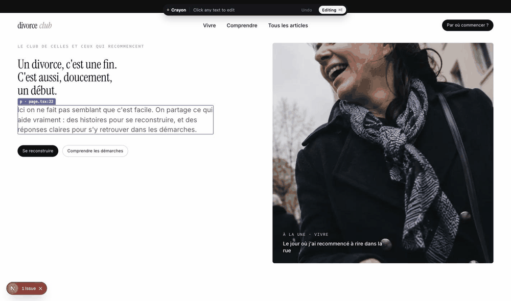

<p align="center">
  
</p>

<h1 align="center">Crayon</h1>

<p align="center">
  Edit your site on the rendered page. Crayon writes the change straight into your code.<br>
  <sub>Next.js · Vite · React · zero config to keep</sub>
</p>

<p align="center">
  <a href="https://github.com/getdom/crayon/actions/workflows/ci.yml"></a>
  <a href="https://www.npmjs.com/package/crayon-dev"></a>
  <a href="LICENSE"></a>
</p>

---

You built a site with Lovable, v0, Bolt, Cursor or Claude Code. Now a headline needs a comma. Prompting the AI again means two minutes, a rebuild, and a chance it touches something else.

Crayon is the other way: open the site, click the text, type, press Enter. The JSX literal is replaced in the right file. Nothing else in the file moves.

```bash
cd my-site
npx crayon-dev
```

<p align="center">
  
</p>

## What Crayon is

- **A content editor, not a design tool.** Text, images, and the type and colour tokens of your Tailwind theme. Never drag-and-drop layout.
- **Deterministic.** Every edit is a surgical AST rewrite of one literal. No LLM in the loop, no reformatting, no surprise diffs.
- **Local.** One process on your machine. No account, no cloud, nothing leaves your computer.
- **Safe to leave in place.** The one-line plugin does nothing unless the Crayon CLI started the dev server.

## Quick start

```bash
cd my-next-or-vite-site
npx crayon-dev
```

First run:

```
✎ Crayon · next · /Users/you/my-site
Crayon needs crayon-dev as a dev dependency and one line in next.config.ts. Set it up now? [Y/n]
✓ crayon-dev added as a dev dependency
✓ next.config.ts updated (inert without Crayon, safe to commit)
Starting npm run dev …

  Crayon ready  http://localhost:4400  → http://localhost:3000
  Click any text on the page to edit it. Enter saves, Esc cancels. Ctrl+C stops.
```

Your browser opens on the Crayon window, which is your site with a thin toolbar. Click any text.

| Action               | Effect                                        |
| -------------------- | --------------------------------------------- |
| Click a text         | Edit it in place                              |
| Enter                | Save to the source file                       |
| Esc                  | Cancel                                        |
| Click elsewhere      | Save                                          |
| ⌘E / Ctrl+E          | Toggle between editing and browsing the site  |
| Undo (toolbar)       | Revert the last write                         |
| ⌘-click / Ctrl-click | Click through to the site while editing is on |

Every write is echoed in the terminal with the file and line:

```
✎ src/components/hero.tsx:42  "Book a demo" → "Book a call"
```

## What it edits today

**Text**

- Written between JSX tags: `<h1>Hello</h1>`, including multi-line text with indentation preserved, or a single word inside a longer text.
- Passed through a component: `<Button>Book a call</Button>`, found by searching the project for that exact string.
- Passed as a prop: `<Field label="Surface">`, `<Card title="Pricing">`.
- Inside a JSX expression: `{isPro ? "Pro plan" : "Free plan"}`.
- In an i18n dictionary or a data file: `{dict.hero.title}` leads to `hero: { title: "…" }` in `messages/fr.ts`; `{post.title}` leads to the frontmatter of the right `.mdx`, or to a JSON or YAML value.

When the same text appears in several places, Crayon uses the expression that renders it (`dict.hero.title`) and the DOM ancestors of the element you clicked to choose the right occurrence.

**Images**

- `` and `<Image src="/hero.png">`: the new file is written next to the current one in `public/`, `src` and `alt` are updated, `height` is fixed when the ratio changed.
- Imported assets (`import hero from "./hero.png"`): the file is replaced on disk, the code does not move.
- Paths stored in content files (frontmatter, JSON) are updated there.

**Styles**, on Tailwind projects

- Size, weight, italic, text colour and font family, as a swap of one class for another: `text-gray-500` becomes `text-primary`.
- The palette is read from your project: your theme's colours first (shadcn tokens, brand colours), then Tailwind's default palette. Fonts are the ones your theme declares.
- Works inside `cn()` and `clsx()` calls. Refused, with the reason, when styles come from a CSS module or a variant function.

When the text cannot be edited safely, Crayon says so instead of guessing:

- **Computed or data-driven** text (`{price} €`, a CMS field, an i18n key) is refused with the file and line that renders it.
- **Ambiguous** text lists the candidates.
- **Composite** text such as `Hello <b>world</b>` is not editable as a whole yet. Click the inner piece instead.
- **Dynamic image sources** (`src={logoUrl}`) name the file and line so you know where the value comes from.

## Supported setups

|                                                  | Status                                         |
| ------------------------------------------------ | ---------------------------------------------- |
| Next.js 16 with Turbopack                        | Tested                                         |
| Next.js 15.3+ with webpack                       | Supported, same loader                         |
| Next.js App Router, server and client components | Tested                                         |
| Vite + React                                     | Supported, plugin written, looking for reports |
| React 18 and 19                                  | Both                                           |
| TypeScript and JavaScript                        | Both, `.tsx` and `.jsx`                        |
| Plain HTML sites                                 | Not yet, see roadmap                           |

Package managers: npm, pnpm, yarn, bun. Crayon runs your existing `dev` script.

## How it works

```
 you            browser                    crayon CLI                  your project
 ───            ───────                    ──────────                  ────────────
 npx crayon-dev ─────────────────────────► detect framework
                                           add one line to config ───► next.config.ts
                                           spawn `npm run dev` ──────► dev server :3000
                                           proxy :4400 ◄──────────────  html + hmr
                open :4400 ◄────────────── inject overlay script
 click text ──► contentEditable
 Enter ───────► ws {file,line,col,old,new} ─► AST rewrite of one node ─► hero.tsx
                HMR re-render ◄──────────────────────────────────────── file changed
```

For a plain HTML folder there is no plugin: Crayon serves the files itself and tags elements from the HTML parser's positions.

1. **The plugin** tags every host element (`div`, `p`, `img`...) with `data-crayon="src/app/page.tsx:42:6"` during development. It is a webpack and Turbopack loader for Next, a `transform` hook for Vite, running before SWC or esbuild. It only activates when the `CRAYON` environment variable is set, which the CLI does.
2. **The CLI** runs your dev script, puts an HTTP proxy in front of it that injects the overlay into HTML responses and forwards HMR websockets untouched, and opens a second websocket for edits.
3. **The writer** parses the file with Babel, finds the JSX element at the tagged position, and replaces the matching text node with `magic-string`. Bytes outside that node are untouched. If the text is not there (it came through a component), it searches the project for the literal.

Details in [docs/ARCHITECTURE.md](docs/ARCHITECTURE.md).

## Configuration

The CLI adds this for you. If you prefer to do it by hand:

```ts
// next.config.ts
import { withCrayon } from "crayon-dev/next";

const nextConfig = {/* ... */};
export default withCrayon(nextConfig);
```

```ts
// vite.config.ts
import { defineConfig } from "vite";
import react from "@vitejs/plugin-react";
import { crayon } from "crayon-dev/vite";

export default defineConfig({ plugins: [react(), crayon()] });
```

Both are no-ops without the CLI. Your `npm run dev` and your production build are unchanged.

## CLI options

```
crayon [dir] [options]

  dir            Project directory (default: current)
  --port <n>     Port of the Crayon window (default: 4400, falls back to the next free port)
  --no-open      Do not open the browser
  --setup        Install the dependency and patch the config without asking
```

## Roadmap

In order. Each step ships when it works on real sites, not before.

1. **Publish**: one button that commits and pushes, so a non-developer can ship a copy change.
2. **Spacing and radius** in the style bar, on the Tailwind scale.
3. **Composite text**: editing `Hello <b>world</b>` as one unit.
4. **Background colours** and button variants.

Not planned: drag-and-drop layout, component creation, anything that makes Crayon a design tool.

## Troubleshooting

See [docs/TROUBLESHOOTING.md](docs/TROUBLESHOOTING.md). The short version:

- **"This text is not written as-is in the code"**: the text is computed. The message names the file and line that renders it.
- **Port 4400 busy**: Crayon picks the next free one and says so.
- **Nothing is tagged (hover shows nothing)**: the config line is missing or the dev server was started without Crayon. Run `npx crayon-dev`, not `npm run dev`.
- **The style bar is missing**: the project has no Tailwind, or the text is rendered by a component whose classes live elsewhere.

## Contributing

Bug reports with a minimal repro are the most useful thing right now, especially on Vite projects and older Next versions. See [CONTRIBUTING.md](CONTRIBUTING.md) for the dev setup and the layout of the code.

## License

[MIT](LICENSE)
